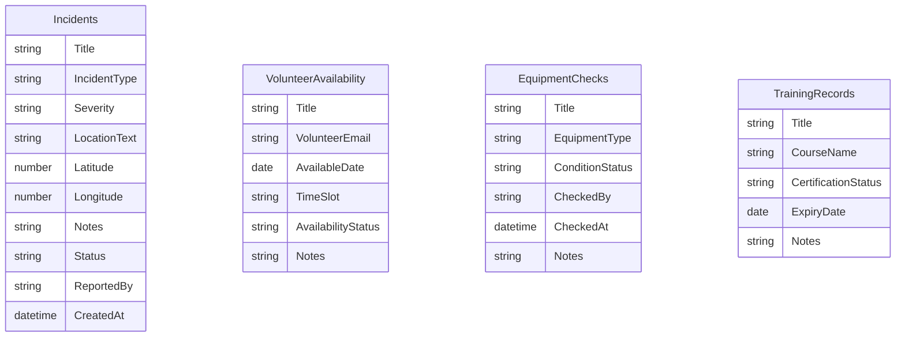
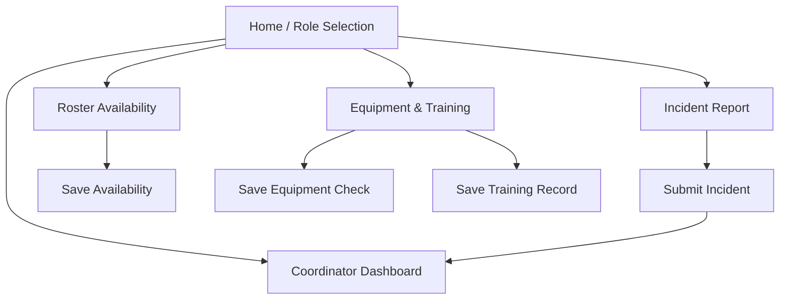

# Technical Documentation

## System Overview
Emergency Services Platform is a Power Apps canvas app prototype for community emergency service volunteers and coordinators. It supports incident reporting, coordinator dashboard review, volunteer availability management, equipment checks, and training/certification tracking.

## Users And Roles
- Volunteer: reports incidents, sets availability, logs equipment checks, views training status.
- Coordinator: reviews active incidents and updates dispatch status.
- Roster Manager: reviews volunteer availability.

The MVP uses an in-app role selector for demonstration. This provides visible role-based behavior for assessment, but it is not a full security boundary. A production version should enforce roles through Microsoft Entra groups and SharePoint permissions.

## Backend Design
Current backend: in-memory Power Apps collections created with `Collect`.

Preferred backend upgrade: SharePoint Lists. The collection names and field names mirror the intended SharePoint Lists so the app can be migrated without changing the documented data model.

## UI Flow

Current Power Apps screen mapping:
- `Screen1`: Home menu and workflow navigation.
- `Screen2`: Incident Report.
- `Screen3`: Coordinator Dashboard.
- `Screen4`: Roster Availability.
- `Screen5`: Equipment & Training.

## Key Design Decisions
- Five-screen structure keeps the MVP close to the A1 requirements while avoiding a crowded single-screen layout.
- Incident reporting is optimized for speed: dropdowns, short note entry, location support, and a single submit action.
- SharePoint Lists remain the preferred backend because they are accessible from student Microsoft accounts and produce observable connector calls in Power Apps Monitor. The submitted MVP currently uses local canvas behavior/collections as a safe prototype fallback.
- Soft role switching is used for assessment demonstration; true tenant RBAC is listed as future work.

## Known Limitations
- The current MVP uses collections, so data is session-scoped unless migrated to SharePoint Lists.
- Location capture depends on browser permission and device availability.
- Offline caching is listed in A1 but may be represented as a limitation unless time permits implementation with `SaveData` and `LoadData`.
- Test Studio may not fully automate modern controls or location prompts.
- App-level role selection is not production security.
